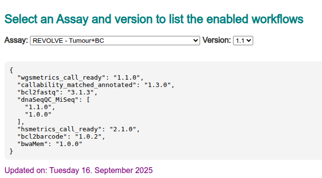
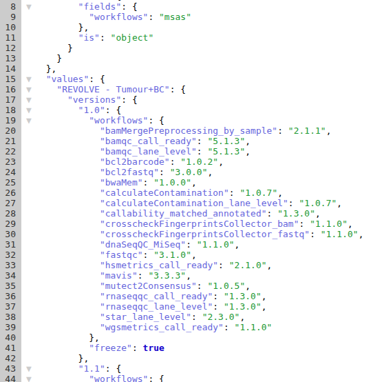
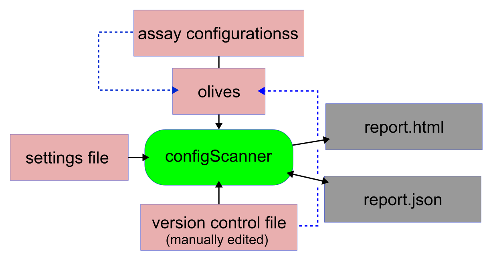

# configScanner
A tracker showing which workflows would run for a given assay. Takes in account both the setting 
for assays and existing checks in olives. If available, version control .jsonconfig will be checked
if a workflow version is specified in this file, it will override the version information
from an olive scan. 

These scripts are for getting information from Bitbucket analysis-config repository. They read
olive files and assay configuration file combining this information and presenting a list of 
workflows which would run for a given assay given exisiting settings. Reported data may be used
for tracking any versions of workflows ran for a given assay/version combination.

reports are in .json and .html formats. Developed in Python 3.12, these script should run with older
(3.10+) python libraries as well.



# Installation

Designed to be modularized, configScanner should be used on Univa network-enabled nodes as a module
However, if you want to install it locally the first thing to do is 

```
   pip install -r requirements.txt
```

configScanner uses a few modules which are not a part of regular python installation.

# Captured Information

We scan the olives for two things - 

* Run tags (workflow alias and it's version) and 
* check performed on assay_info.jsonconfig file 

The supplied .toml file specifies regex patterns to use when searching for assay configuration checks.

assay_info.jsonconfig file is also scanned and analyzed. The final report indicates which workflows 
would run given a particular assay/version combination with the following benefits:

* Ability to see which unwanted workflows are enabled for an assay
* Data to use with downstream reporting/analysis
* Mainainance of a version control file (see below)

# Running the script

The script should be run as 

```
  python3 runConfigScanner.py -i [INSTANCE] -o [OUTPUT_JSON] -j [PATH TO JS] -r [VERSIONS_FILE] -p [OUTPUT HTML]

```

# Full list of Options

Following options are available:

* -s Settings file in TOML format (Default is config.toml)
* -i Instance to scan - this is required, has to match the directory in code repository with olive files
* -o Output json, data dump       (Default is enabled_workflows.jsoni, this is also checked and updated)
* -p Output HTML page             (Default is running_workflows.html)
* -j Path to JavaScript file for embedding into HTML report page
* -r Path to version control file, not required but can be used to control versions of enabled workflows

Settings file specify various configuration parameters and at this point has 4 sections:

* data        - information related to repos for olives
* instances   - this is to specify our shesmu instances (clinical and research) - there may be changes in a future
* checks      - regex patterns for finding assay_info checks in olives

Script will run collecting workflow names as they are used in olives, then it will proceed to analyze this information
together with assay settings. After bringing all of these data together, the script will output .json and .html reports

# Workflow version control

Workflow version control is designed around checking and [manually] updating a version controlling .jsonconfig file. The syntax is 
very similar to the syntax of the report file, but it may be used for controlling version of workflows for 
selected assays/olive combinations



The logic of version control can be also summarized as the following flowchart:



As the diagram shows, we may have a situation when a new workflow appears in production environment we are 
scanning. In this case the workflow version will be registered with all assays which are running it unless
the configuration is controlled by version control .jsonconfig (the latter is very rare).

# Running as a cron job

The main goal here is to run automatic updates, and the most practical way to do it is to use crontab.
